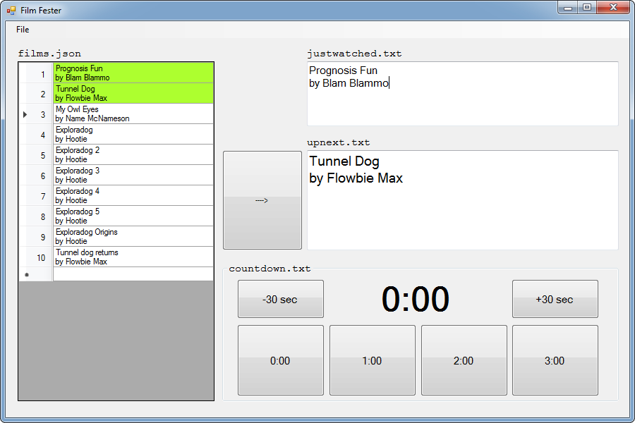
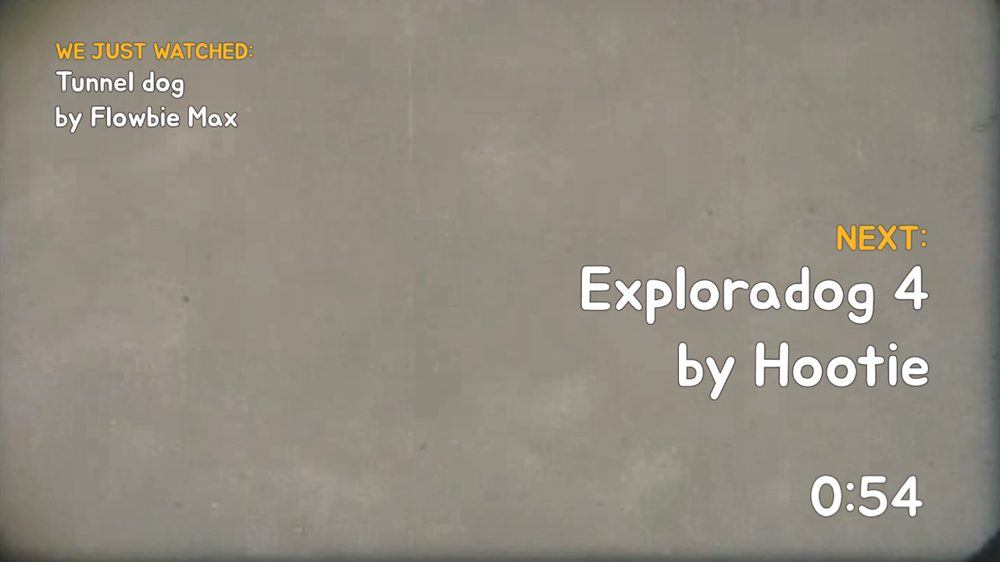

# Film Fester

## About
I organized and ran a small online student film festival, and made this program to help automate the intermission screens.

Here is [a short writeup about how the festival was run](http://blendogames.com/news/post/2020-05-21-film-festival).

Film Fester is a basic control board for managing on-screen text & countdown timer, and is designed to hook into [OBS Studio](https://obsproject.com). It was used to automate the intermission screens between each film, where we displayed:
- What we're going to watch next.
- What was the film we just watched.
- The intermission countdown timer.

Here's a sample of how the intermission screen in OBS can look like:

## Setup
Here's how to set up Film Fester:
1. Open `films.json` and edit it to include your film titles.
2. In OBS, make a **Text** source and make it read from `justwatched.txt`
3. In OBS, make a **Text** source and make it read from `upnext.txt`
4. In OBS, make a **Text** source and make it read from `countdown.txt`
5. That's it. Film Fester is now hooked up to display titles and show the countdown.

## Usage
Here's how I typically use Film Fester and OBS together:
1. In OBS, you'll need at least 2 source screens: an intermission screen and a movie screen. The intermission screen has the "just watched", "up next", "countdown" stuff. The movie screen just plays the movie file. More details: [click here](https://blendogames.com/news/post/2020-05-21-film-festival).
2. In FilmFester I click the big arrow button to update OBS's intermission screen.
3. The person who made the film says their intro. During this time, I queue up their movie video file.
4. When the person's intro is done, I switch to the movie screen. The queued-up movie plays.
5. As the movie is playing, I click FilmFester's big arrow button to queue up the next film.
6. When the movie is done, I switch back to the intermission screen. We loop back to step 3.

## Notes
This is written in C# and a .sln solution for Visual Studio 2010 is provided. Windows only.

Pre-compiled binaries can be found in the [Releases page](https://github.com/blendogames/filmfester/releases).

## License
This source code is licensed under the zlib license. Read the license details here: [LICENSE.md](https://github.com/blendogames/filmfester/blob/master/LICENSE.md)

## Credits
by [Brendon Chung](http://blendogames.com)

## Libraries used
- [Json.NET](https://www.newtonsoft.com/json)
